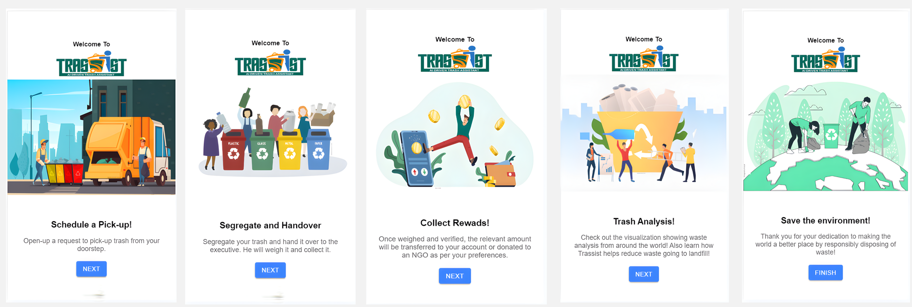
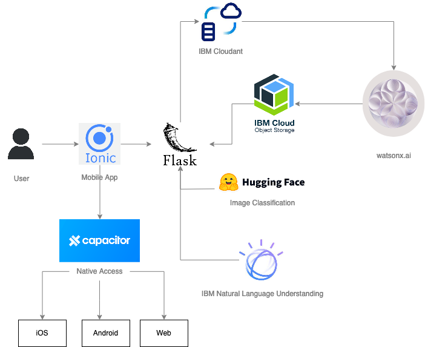
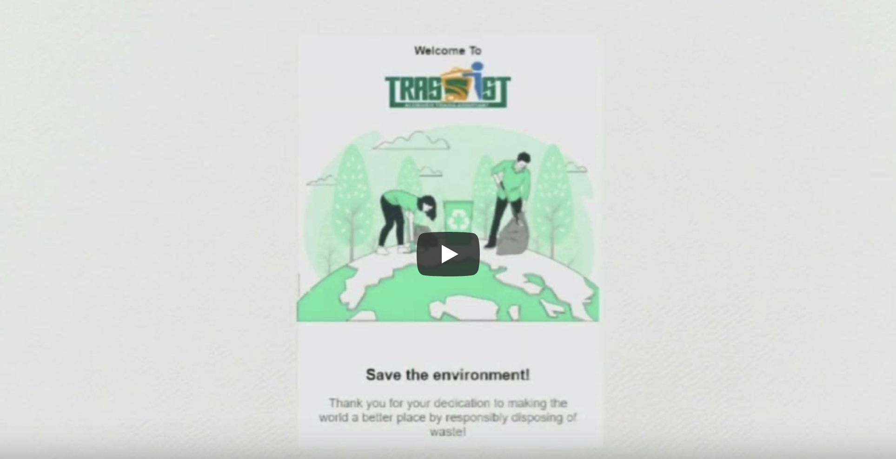
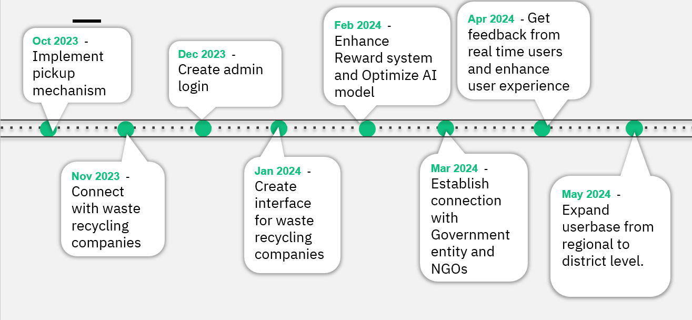

# Trassist-An AI Driven Trash Assistant

- [Project summary](#project-summary)
  - [The issue we are hoping to solve](#the-issue-we-are-hoping-to-solve)
  - [How our technology solution can help](#how-our-technology-solution-can-help)
  - [Our idea](#our-idea)
- [Technology implementation](#technology-implementation)
  - [IBM AI service(s) used](#ibm-ai-services-used)
  - [Other IBM technology used](#other-ibm-technology-used)
  - [Solution architecture](#solution-architecture)
- [Presentation materials](#presentation-materials)
  - [Solution demo video](#solution-demo-video)
  - [Project development roadmap](#project-development-roadmap)
- [Additional details](#additional-details)
  - [How to run the project](#how-to-run-the-project)
  - [Contributing](#contributing)
  - [Contact Details](#contact)
    

## Project summary

### The issue we are hoping to solve

- Waste management is a major challenge faced both in India and the world. 
- The World Bank estimates that 2.12 billion tons of waste are dumped in landfills worldwide each year, with the US, China, and India accounting for over half of this.
- Most of the waste is recyclable, and even some of it such as plastic, can be converted into fuel. However, due to improper waste management, most of the waste ends up in the landfills.
- There are four main pain points of waste management:

      1. Lack of Awareness
      2. Segregation
      3. Collection
      4. Lack of Traceability
- Our solution addresses all of these pain points and creates an effective waste management system that avoids trash going to the landfills and promotes recycling.

### How our technology solution can help

We have designed a system to reduce trash going to landfills by seggregating and collecting it at the source and transferring it to the recycling stations.

### Our idea

#### Trassist Application
We have created a mobile application called Trassit to reach out to users and collect their household trash.

#### How the app works?


The above figure explains how to use app in detail.

-	After logging in, a user can schedule a pickup to give away their trash to ‘Trassist’. To do this, the user needs to click and upload pictures of their household trash in the app. Once the pictures get uploaded, AI-based Vision Model will run in the backend to identify each type of trash that matches the list defined in the system.
-	This redirects the user to the next page where they will see a complete list of identified trash wherein the user needs to add an approximate weight for the listed trash items. If an item is not detected by the model, or if an irrelevant item is detected, user can add or remove it manually.
-	After submitting the final list, the app will show an approximate reward value based on that day's waste rate. The user can see waste rates from the rate card available on the home screen or from the side panel options. Along with the reward points, the app displays the amount of carbon footprint the user has helped us in reducing, a sustainable step towards saving the environment.
-	The reward value shown is an approximate calculation which will be confirmed by the trash collector once they inspect and weigh the trash during collection. This is how pickup is scheduled. The trash collector will then contact the user and come to their doorstep to collect the segregated waste. 
-	When the trash collector arrives, the user needs to provide them with the segregated waste. The trash collector will bag it and weigh it. Once the waste is submitted, the rewards will be added to the user's account. The user can convert these reward points to cash or donate them to NGOs as per their liking.
  
#### How is trash processed?
After collecting trash from the user’s doorstep, it will be transported to specific waste recycling stations. We have a number of waste recycling stations connected with our service, and we try to reduce carbon footprint by optimizing those transportation paths.

#### How are rewards calculated?
- We have different buying rates for each type of trash, including plastic, electronic waste, paper, metal, glass, and textile. The rate card is displayed on the homepage.
- When a user provides the approximate weight of trash for each category, the total rewards are calculated by multiplying the approximate weight by the rate of that given trash on that day.
- Please note that the amount shown on the screen is an approximate amount. It will be updated by the trash collector after they weigh and inspect the trash.

#### How are funds generated to provide rewards to the users?
-	We will be collaborating with local government Municipal Corporations to implement our service.
-	Also, we will get some funds from waste recycling industries. 
-	The main source of fund will be by trading Carbon Credits.
-	Following a unique way(decentralized) of distribution of fund/rewards across each entity like company, trash collector and user, will be the ideal approach to be undertaken.
  
#### Business value associated with project
-	According to the current market scenario, data is the new fuel. We will generate a huge amount of authenticated data, which will be useful for a number of industries, from the manufacturing sector to the waste recycling sector, as well as for the government.
-	It will reduce cost of waste collection and transportation by optimizing the trash flows from generation points to waste recycling stations.
-	Users will be benefited with rewards in exchange of waste.
-	Ultimately, a huge amount of waste will be avoided from being dumped into the landfills, which in turn will help us make the world a better place to live.
  
#### Other aspects of Trassist App
-	Users can check how much trash they have provided for recycling in the past under the History tab on the side panel.
-	A User Guide is provided on the side panel, to educate the users about trash segregation and how ‘Trassit’ works.
-	Users can see comprehensive visualizations generated through IBM watsonx.ai visualization platform. It can consider data on waste generated individually, as well as for specific geographic locations, societies, and regions, so users and societies can compete to reduce their carbon footprints.
-	Twitter sentiments, emotions, and keywords around the topic of Waste Management are generated using IBM Natural Language Understanding and are shown under the Trending tab on the side panel. 


## Technology implementation

### IBM AI service(s) used

- [IBM Natural Language Understanding](https://cloud.ibm.com/catalog/services/natural-language-understanding) - The **Trending** tab in our mobile app displays the trending topics, distribution of emotions and sentiments around waste management extracted using this service.
- [watsonx.ai](https://dataplatform.cloud.ibm.com/wx/home?context=wx) - The **Stats** tab in our mobile app displays a pie chart and scatter plot using vizualization of this service based on the stored data.

### Other IBM technology used

- [IBM Cloundant](https://cloud.ibm.com/catalog/services/cloudant) - This service helps us store our user base data along with captured trash pictures.
- [IBM Cloud Object Storage](https://cloud.ibm.com/objectstorage/create) - This service helps us save vizualizations created using watsonx.ai service and make it available for our mobile app.

### Solution architecture




Diagram and step-by-step description of the flow of our solution:

1. The user navigates to the mobile application and uploads trash pictures.
2. Hugging Face OpenAI Vision Model processes the images and identifies the trash.
3. The app stores the user data within IBM Cloudant for analysis.
4. IBM watsonx.ai vizualizes the stored data from Cloudant and stores as objects in IBM Cloud Object Storage.
5. IBM Natural Language Processing extracts keywords, sentiments, and emotions for waste management trends and awareness.

## Presentation materials

### Solution demo video

[](https://www.youtube.com/watch?v=hSL6RowUMt0)

### PowerPoint presentation
Please review the attached [PPT](docs/Trassist_presentation.pdf) for a comprehensive understanding of the project.

### Project development roadmap

The project currently does the following things.

- User can use Trassit app to schedule a request for trash collection. 
- AI-based Vision Model runs at backend and detects trash type from images. 
- App calculates and shows approximate values of rewards and Carbon footprint saved using provided weight of trash. 
- The Trending tab in app displays the trending topics, distribution of emotions and sentiments around waste management extracted using IBM Natural Language Understanding
- Stats tab in app displays a pie chart and scatter plot of available data using visualization generated through the Watson-X AI

In the future we plan to...

See below for our proposed schedule on next steps after Call for Code 2023 submission.




## Additional details

### How to run the project

#### To start the frontend server

From the root directory :

```bash
cd frontend-ionic-app
npm install
npm ionic server
```
The frontend server is now running at <http://localhost:8100>

#### To start the backend server

_If it's your first time running the server, create a virtual environment and install the required libs._

create a conda env and activate it
```
conda create --name trassist_backend python=3.10
conda activate trassist_backend
```

Install the libraries
```
cd Project-Trassist
pip install -r requiremnets.txt
```

create .env file at the same level as app.py :

```bash
API_KEY=

CLOUDANT_USERNAME= 
CLOUDANT_PASSWORD= 
CLOUDANT_URL=

COS_ENDPOINT=  
COS_API_KEY_ID=  
COS_INSTANCE_CRN= 
BUCKET_NAME= 
```

From the root directory :

```bash
# after activating the env
python app.py
```

The backend server is now running at <http://localhost:5000>

See our [description document](./docs/DESCRIPTION.md) for log in credentials.

### Contributing

Please read [CONTRIBUTING.md](CONTRIBUTING.md) for the process for submitting pull requests to us.

### Contact
Contact us by email to ask questions, discuss more about project and implementation. <br/>
The contact emails are:
1. Yogesh Jadhav (yogesh_jadhav2@persistent.com)
2. Swapnaja Achintalwar (swapnaja_achintalwar@persistent.com)
3. Mahendra Swain (praveenkumar_d@persistent.com)
4. Ashu Gulati (ashu_gulati@persistent.com)
5. Praveen Kumar (mahendra_swain@persistent.com)
